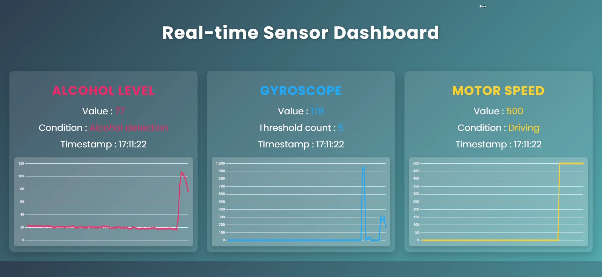

<h1 align="left">🚗 AlcoholWatcher</h1>

<b>음주운전 방지를 위한 IoT + Embedded + Web 시스템</b>

AlcoholWatcher는 음주운전 방지를 위한 시스템으로, 사용자의 혈중알코올농도를 측정하고 차량의 속도와 시동을 제어합니다.

이 프로젝트는 A-SPICE Software Engineering 프로세스를 기반으로 수행되었습니다.

---
## 🎬 시연 영상
- **https://youtu.be/z9DGNRnyafg**

## 📂 PPT 발표 자료
- **https://buly.kr/4xY1Set**

---

## 📌 주요 기능
- **1차 로직**
  - Input : 알코올 센서 → 혈중 알코올 농도 측정  
  - Output : 스피커 경고  
    > "음주 상태가 감지되었습니다. 차량이 제한될 수 있습니다."

- **2차 로직**
  - Input : 자이로 센서 (조향/가속 감지)  
  - Output A : 스피커 경고  
    > "즉시 차량을 멈추십시오. 차량의 속도가 감속됩니다."  
  - Output B : 다른 차량에 알림  
    > "조심하세요. 주위에 음주운전 차량이 있습니다."  
  - Output C : 보행자 앱 알림  

- **3차 로직**
  - Input : 모터 스피드 제어 (10초당 PWM 100 감소)  
  - Output : 스피커 경고  
    > "10초 후 차량이 정지됩니다."

- **센서 데이터 모니터링 대시보드**
  - 실시간 알코올 센서, 자이로, 모터 스피드 값 모니터링  
  - 

---

## 📡 시스템 아키텍처

  

---

## 🛠 기술 스택

  
  
  
  
  

---
## 👥 함께한 사람
- **윤용성** - 웹 풀스택 개발 / STM32, ESP32, 서버 통신 개발
- **장승원** - 하드웨어 회로 설계 / 센서 통합
- **민경서** - STM32, ESP32, 서버 통신 개발 / 아키텍처 설계 및 문서관리
- **이지호** - 스피커 센서 설계 / 요구사항 분석 및 테스트
- **오동훈** - STM32, ESP32, 서버 통신 개발 / 보행자 안드로이드 앱 개발
